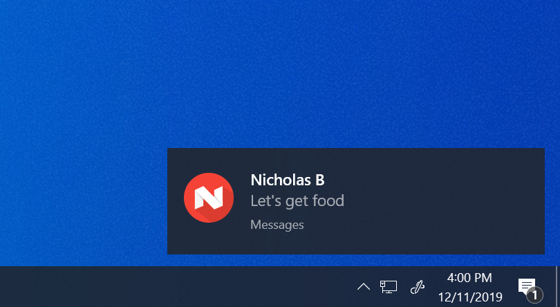

# NotifyServer
Desktop server for Notify, an Android application that sends notifications from an Android phone to a computer and notifies the user



## Requirements
Node.js

## Setup
Start server by running
```cmd
node app.js PORT
```
in a command line

PORT is the port on which you would like the server to listen (default is 3000)

## Author
James Peccia
